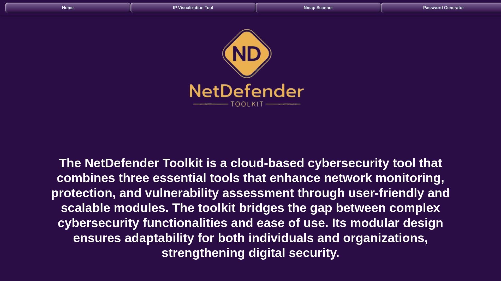
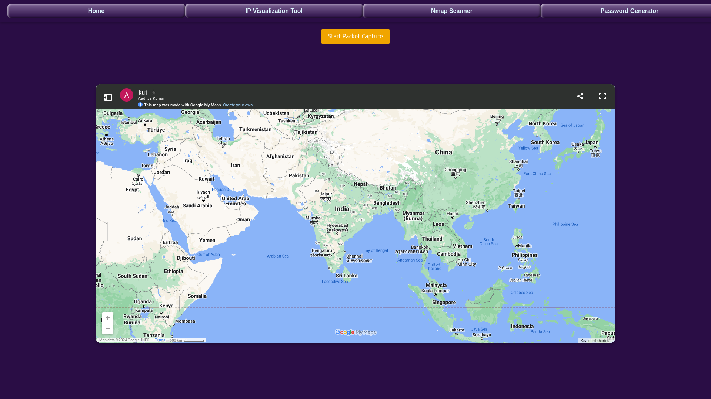
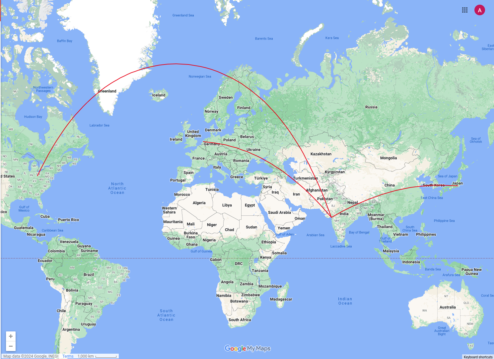
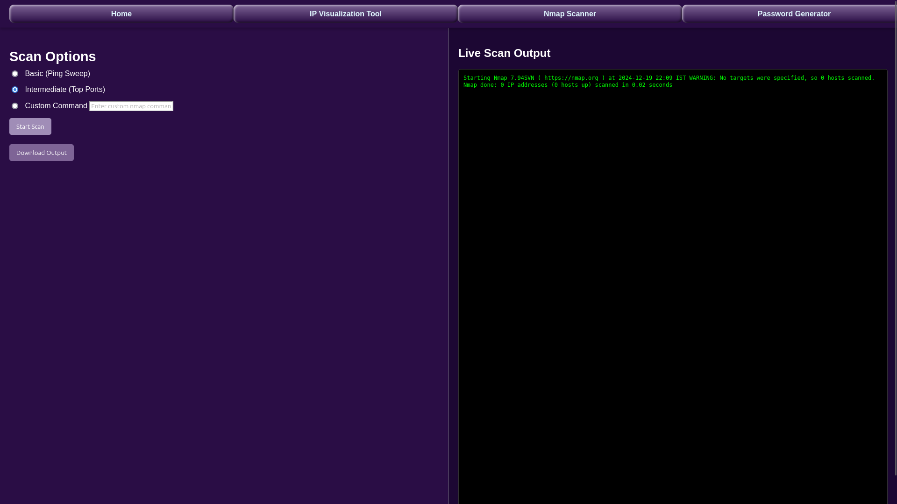
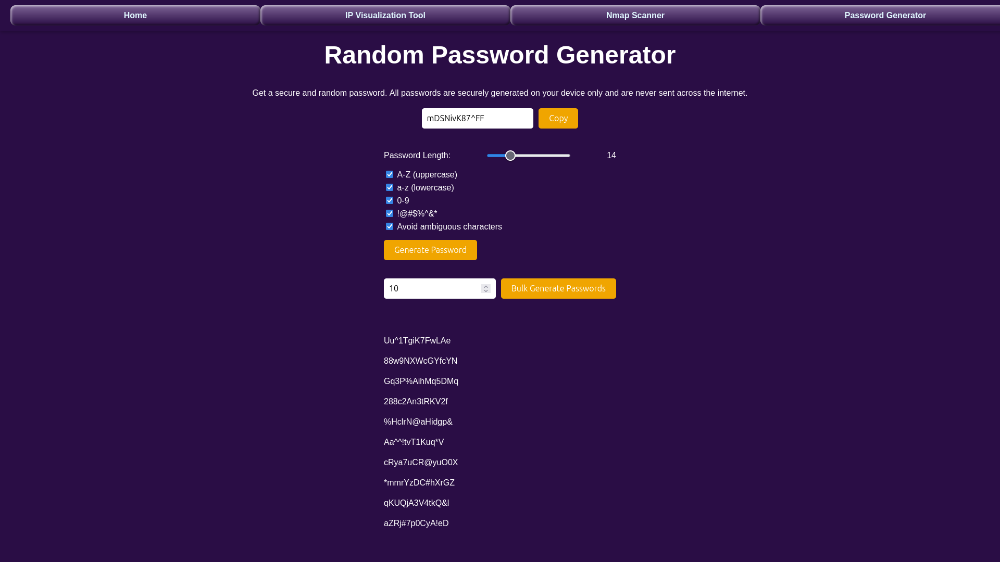

# Project Documentation
Create a folder named 'captures' in the same directory where the manage.py file is located.


## Introduction
This document provides an overview of the project and includes screenshots for better understanding.

## Features
1. **Home Page:**
    The NetDefender Toolkit is a complete solution developed in order to bring protection through
    improving the security of cloud environments by implementing the most important functionalities in
    order to address emerging threats. The toolkit consists of three crucial modules: IP Address
    Visualization Tool, Password Generator Tool and Nmap Scanner Tool.
   

2. **IP Visualization:**
    The IP Address Visualization Tool analyses network traffic, identifies source and destination IPs and
    maps them geographically, providing real-time monitoring through Wireshark and Google My Maps.
    This helps the network administrator easily identify traffic patterns and possible risks.
   

3. **Response of IP Visualization**
   

4. **NMAP:**
    The Nmap Scanner Tool, with the powerful capabilities of Nmap, scans networks and host
    discovery, in addition to vulnerability assessment, through an easy-to-use interface suitable for users
    with varied skill levels.
   

5. **Random Password Generator:**
    The Password Generator Tool allows for the generation of highly secure, random passwords tailored
    to user-defined specifications, bringing them resistance against brute-force and dictionary attacks.
   

## Installation
Follow these steps to set up the project:
1. Clone the repository:  
   ```bash
   git clone https://github.com/picrakhihai/netDefender-toolkit
